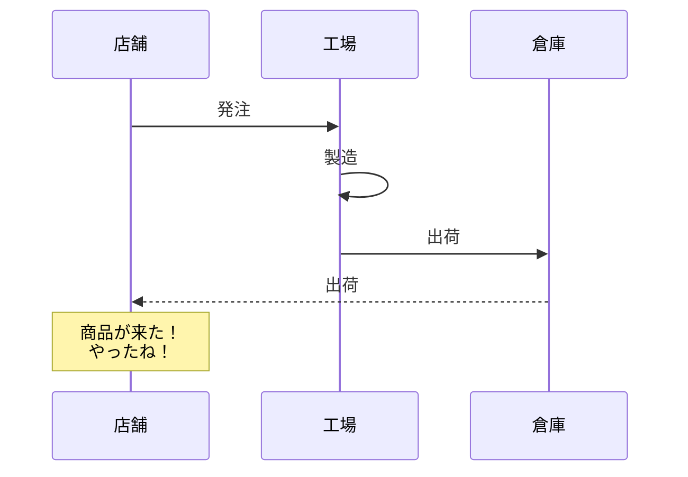

#### オープニング
#### Meetupの発表内容
##### ①Twelve-Factor Appで読み解く、モダンなアプリの理想とレガシーなアプリの現実
##### ②開発グループが開発チームになるまでの歩み
##### ③結果整合性ができない開発者のドメインイベント活用例

 - 好きな言語
    - Java
    - PHP
  - 好きなエディタ
    - VSCode
    - Vim
    - Typora
  - 好きなメディア
    - はてなブックマーク
    - Qiita

|日付 | カテゴリー | イベントテーマ |
|---:| :---: | :--- |
|2020/6/17 | Meetup | SaaSを支える品質担保術|
|2020/6/19 | PHP | TechCafe|
|2020/6/24 | Meetup | SaaSを支える開発原則|
|2020/6/26 | オブジェクト指向 | オブジェクト指向LT会|
|右寄せ| 中央揃え | 左寄せ |

7月もラクスの**Meetup**と**勉強会**が目白押しだよ！！

アンケートの結果、先月は実に~~80%~~ 90% の方から高い満足度が得られました！

