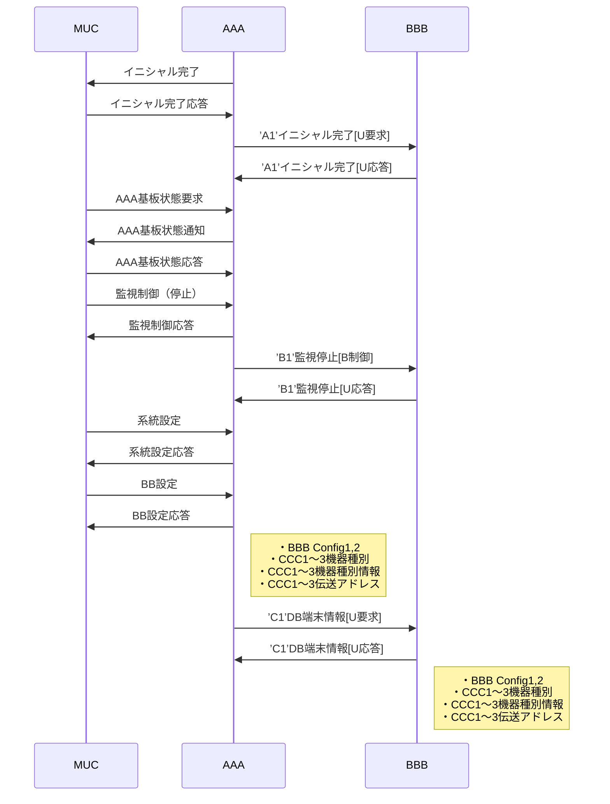

#####ソフテックだより 第３４１号（2019年11月6日発行）
###技術レポート
##「内部設計書に書くべきこと～組込みソフト開発の場合～」

####1.はじめに
私はソフテックに入社して15年超の社員で、主に組込みソフトの開発に携わっています。最近、関わった仕事で、内部設計フェーズにおいてどういった資料を作成すべきかを見直す機会がありました。
今回のソフテックだよりでは、組込みソフト開発において内部設計書に書くべき内容について、まとめてみたいと思います。ソフテックで実際に作成している資料など、できるだけ具体的な例をあげて、ご説明していきます。

####2.内部設計書とは
内部設計書とは、一般的に、ユーザーの目に見えないシステム内部の設計を記述したドキュメントを指します。詳細設計書と呼ばれる場合もあり、ソフトウェアのプログラミングを行うために必要な資料になります。
ソフトウェアの開発プロセスは一般的に下図のようなV字モデルで示されますが、その中で、内部設計書を作成する段階は、要件定義と基本設計（外部設計）が完了した後、プログラミング（コーディング）を行う前の作業になります。

<strong>図1. V字モデルと開発プロセス</strong>

 
独立行政法人情報処理推進機構（以下、IPA）がまとめた組込みソフトウェア向け開発プロセスガイド(*1)では、この詳細設計/内部設計のフェーズをさらに3段階に細分化しています。その3つとは、ソフトウェア要求定義（SWP1）、ソフトウェア・アーキテクチャ設計（SWP2）、ソフトウェア詳細設計（SWP3）です。そのプロセス（前掲書の中では”アクティビティ”と呼んでいます）の概要を抜粋したものが下表になります。

<strong>表1. 内部設計のアクティビティ概要</strong>

|ID|アクティビティ|アクティビティの概要|構成するタスク|
|:--|:--|:--|:--|
|SWP1|ソフトウェア要求定義|当該製品を実現するためにソフトウェアとして実現が必要となる要求を明確にする。|SWP1.1 ソフトウェア要求仕様書の作成 SWP1.2　ソフトウェア要求仕様の確認|
|SWP2|ソフトウェア・アーキテクチャ設計|開発する組込みソフトウェアのアーキテクチャ（＝動作[振る舞い]と構造）を決定する。|SSWP2.1 ソフトウェア・アーキテクチャ設計書の作成 SWP2.2 ソフトウェア・アーキテクチャ設計の確認 SWP2.3 ソフトウェア・アーキテクチャ設計の共同レビュー|
|SWP3|ソフトウェア詳細設計|ソフトウェア・アーキテクチャ設計で定義された機能ユニットをプログラムユニットに分割し、詳細な振る舞いや論理構造などを設計する。|SSWP3.1 機能ユニット詳細設計書の作成 SWP3.2 ソフトウェア詳細設計の確認 SWP3.3 ハードウェア仕様とのの整合性の確認|

表1中で設計書の作成に該当するタスクを赤字で示しました。これら赤字で示したタスクから、アウトプットとして抽出される項目、最終的に作成されるドキュメントをまとめると下表の通りとなります。

<strong>表2. 内部設計のタスクとアウトプット</strong>

|タスク|アウトプット|作成ドキュメント|
|:--|:--|:--|
|SWP1.1 ソフトウェア要求仕様書の作成|(SW101)制約条件リスト (SW102)ソフトウェア機能要求リスト (SW103)ソフトウェア非機能要求リスト (SW104)優先順位付けされたソフトウェア要求リスト|(SW105)ソフトウェア要求仕様書|
|SWP2.1 ソフトウェア・アーキテクチャ設計書の作成|(SW201)ソフトウェア構成設計書 (SW202)機能ユニット設計書 (SW203)ソフトウェア動作設計書 (SW204)ソフトウェア・インタフェース設計書 （設計条件確認メモ） （性能試算資料） （メモリ使用試算資料）|(SW205)ソフトウェア・アーキテクチャ設計書|
|SWP3.1 機能ユニット詳細設計書の作成|(SW301)プログラムユニット機能/構成設計書 (SW302)プログラムユニット設計書 (SW303)プログラムユニット・インタフェース設計書 (SW304)メモリ使用量 （メモ）|(SW305)ソフトウェア詳細設計書|

表2の内容から、内部設計書として作成すべきものは、ソフトウェア要求仕様書（SW105）、ソフトウェア・アーキテクチャ設計書（SW205）、ソフトウェア詳細設計書（SW305）の3点に集約されることがわかります。

####3. 作成資料の具体例
では実際に、これら3つの内部設計書に何を書くべきかを、ソフテックで作成している資料の具体例を挙げて、説明していきたいと思います。前掲書では、内部設計書は3点に集約されていましたが、ソフテックで作成する内部設計書は、ケースバイケースで、設計書が1つにまとまる場合も、3点以上になる場合もあります。大切なことは設計書の数ではなく、必要なことが書いてあるかどうかだと思います。一般的な傾向として、開発するプログラムの規模が大きくなればなるほど、設計書として記述すべき内容は増えていきます。

#####3.1 ソフトウェア要求仕様書として書くべきこと
再び、IPAの組込みソフトウェア向け開発プロセスガイドに話を戻し、ソフトウェア要求仕様書作成時に実施する内容を下表にまとめます。実施内容とリンクする形で、ソフテックで作成している資料の具体例を抽出しています。

<strong>表3. ソフトウェア要求仕様の作成資料</strong>

|アウトプット|アウトプット作成の実施内容|ソフテックでの作成資料例|
|:--|:--|:--|
|(SW101)制約条件リスト|以下に示す(1)～(6)の事項を確認し、制約条件リストとして整理する。 (1)製品企画、製品開発戦略を確認する。ソフトウェア要求を定義するにあたって、考慮すべき製品目標を確認する。 (2)製品特性を確認する。 (3)製品のステークホルダを確認する。 (4)製品構成を確認する。 (5)再利用ソフトウェアを明確にする。 (6)ソフトウェアの開発環境、テスト環境、導入環境を確認する。|(4)・システム構成図（ハードウェア構成） ・ソフトウェア構成図（利用するOS、ミドルウェア） (6)・開発環境/動作環境|
|(SW102)ソフトウェア機能要求リスト|システムとして実現。提供する機能のうち、ソフトウェアで実現する機能を明確にし、ソフトウェア機能要求リストを作成する。|・機能要求リスト|
|(SW103)ソフトウェア非機能要求リスト|(システムとしての機能の実現において関係すると考えられるソフトウェアの非機能的な側面の要求を明確にし、ソフトウェア非機能要求リストにまとめる。（信頼性要求、保守性要求、移植性要求、セキュリティ要求など）|・非機能要求リスト|
|(SW104)優先順位付けされたソフトウェア要求リスト|(SW102)、(SW103)をもとに、ソフトウェアとして実現する要求に優先順位付けを行う。||

以降では、表3で示したシステム構成図（3-1-1）、ソフトウェア構成図（3-1-2）、開発環境/運用環境（3-1-3）、機能要求リスト（3-1-4）、非機能要求リスト（3-1-5）について、ソフテックでの作成例を交えて説明していきます。なお、具体例は複数のシステムから抜粋したものを一部加工して掲載しています。同一のシステムを示すものではありませんので、ご了承ください。

#####3.1.1システム構成図
システム構成図は、外部設計段階でも作成する内容になりますが、内部設計書では、システム全体のどの部分を設計の対象としているかを明確にするうえで役立ちます。ソフテックでVisioを使用して作成したシステム構成図の例を以下に示します。開発対象となる機器にどういった機器が接続され、どのようなインタフェースを持つのかが、一見してわかるように記述していきます。

<strong>図2. システム構成図の例</strong>

#####3.1.2 ソフトウェア構成図
ソフトウェア構成図は、ソフトウェア階層を構造化してわかりやすく記載した図です。簡易的なソフトウェア構成図の例を以下に示します。下図の例では階層的な構造を示していますが、ブロック形式で示す場合もあります。組込みソフトウェア開発でも、大規模なものでは、OSやプロトコルスタックを使用すると、階層が複雑になる場合があります。OS、ミドルウェアなどは自作せずに購入する場合が多いため、開発の対象を明確にするうえでも大切な項目になります。以下の例では省略していますが、市販品を使用する場合はメーカーやバージョンも記載しておきます。

<strong>図3. ソフトウェア構成図の例</strong>

#####3.1.3 開発環境/動作環境
開発環境としては、コンパイラや統合開発環境にどのメーカーの、どのバージョンのものを使用するかを明確にしておきます。動作環境（運用環境）は組込みソフト開発の場合、そのシステム専用に開発した基板の場合もありますが、市販の基板を使用する場合もありますので、その場合はメーカーや型式なども明記しておきます

<strong>図4. 開発環境動/作環境の例</strong>

#####3.1.4 機能要求リスト
機能要求リストは開発するソフトウェアで実現する機能を網羅したものです。ソフテックでは内部設計書類の一部として、WORD文書にまとめる場合が多いです。機能要求は、外部設計またはその前の段階でもまとめてあると思いますが、ここではプログラミング時の注意点にフォーカスしてまとめることになります。

<strong>図5. 機能要求リストの例</strong>

#####3.1.5 非機能要求リスト
非機能要求リストは、信頼性要求、保守性要求、移植性要求、セキュリティ要求などソフトウェアの非機能的な要求事項をまとめたものです。以下に、ソフテックで作成したソフトウェア起動時の初期化処理の内容をまとめたものを例として示します。非機能要求リストも、機能要求リストと同様にソフテックでは内部設計書類の一部として、WORD文書にまとめています。非機能要求は、外部設計段階では明確に規定しない場合もあるため、内部設計段階で明確にすることが重要です。

<strong>図6. 非機能要求リストの例</strong>

#####3.2 ソフトウェア・アーキテクチャ設計書/ソフトウェア詳細設計書として書くべきこと
三度、IPAの組込みソフトウェア向け開発プロセスガイドに話を戻し、ソフトウェア設計書およびソフトウェア詳細設計書の作成時に実施する内容を下表にまとめます。実施内容とリンクする形で、ソフテックで作成している資料を抽出しています。

<strong>表4. ソフトウェア・アーキテクチャ設計の作成資料</strong>

|アウトプット|アウトプット作成の実施内容|ソフテックでの作成資料例|
|:--|:--|:--|
|(SW101)制約条件リスト|以下に示す(1)～(6)の事項を確認し、制約条件リストとして整理する。 (1)製品企画、製品開発戦略を確認する。ソフトウェア要求を定義するにあたって、考慮すべき製品目標を確認する。 (2)製品特性を確認する。 (3)製品のステークホルダを確認する。 (4)製品構成を確認する。 (5)再利用ソフトウェアを明確にする。 (6)ソフトウェアの開発環境、テスト環境、導入環境を確認する。|(4)・システム構成図（ハードウェア構成） ・ソフトウェア構成図（利用するOS、ミドルウェア） (6)・開発環境/動作環境|
|(SW102)ソフトウェア機能要求リスト|システムとして実現。提供する機能のうち、ソフトウェアで実現する機能を明確にし、ソフトウェア機能要求リストを作成する。|・機能要求リスト|
|(SW103)ソフトウェア非機能要求リスト|(システムとしての機能の実現において関係すると考えられるソフトウェアの非機能的な側面の要求を明確にし、ソフトウェア非機能要求リストにまとめる。（信頼性要求、保守性要求、移植性要求、セキュリティ要求など）|・非機能要求リスト|
|(SW104)優先順位付けされたソフトウェア要求リスト|(SW102)、(SW103)をもとに、ソフトウェアとして実現する要求に優先順位付けを行う。||

<strong>表5. ソフトウェア詳細設計の作成資料</strong>

| タスク                         | アウトプット作成の実施内容                                         | ソフテックでの作成資料例       |
|-----------------------------|-------------------------------------------------------|--------------------|
| (SW301)プログラムユニット機能/構成設計書    | 機能ユニットをプログラムユニットに分割し、プログラムユニットの構成と各々の機能を定義する。         | ・ユニット（タスク）構成図      |
| (SW302)プログラムユニット設計書         | (1) プログラムユニットの処理内容を実装可能なレベルまで詳細化する。  (2) 不具合を解析する際に利用する機能もプログラム内容として詳細内容を検討する。                  | (1)・CPUリソース使用一覧 ・状態遷移表/遷移図 ・関数仕様   |
| (SW303)プログラムユニット・インタフェース設計書 | ソフトウェアを構成する個々の機能ユニット、プログラムユニットそれぞれの間のインタフェースを詳細に定義する。 | ・ユニット（タスク）間メッセージ仕様 |
| (SW304)メモリ使用量（メモ）           | ソフトウェアの実現に際して必要となるメモリ量を見積もる。（ROM、RAM、スタックエリア等）        | ・アドレスマップ ・メモリ使用量算出表|

以降では、表4および表5で示したアドレスマップ（3-2-1）、メモリ使用量算出表（3-2-2）、CPUリソース使用一覧（3-2-3）、ユニット（タスク）構成図（3-2-4）、ユニット（タスク）間メッセージ仕様（3-2-5）、ユニット（タスク）シーケンス仕様（3-2-6）、状態遷移表/遷移図（3-2-7）、関数仕様（3-2-8）について、ソフテックでの作成例を交えて説明していきます。なお、具体例は複数のシステムから抜粋したものを一部加工して掲載しています。

#####3.2.1 アドレスマップ
アドレスマップは、CPUのROM、RAM空間にどのようなセクションを設けて、どう配置するかを記載したものになります。以下に、ソフテックでExcelを使用して作成したアドレスマップの例を示します。この例では、ブートローダソフトと、アプリケーションソフトの2つを同一CPUに書き込んで使用しています。それぞれでDebugビルド/Releaseビルドの2種類が存在するため、合計4つのアドレスマップを記載しています。プログラミング段階では、この設定をリンカーのセクション定義に使用することになります。

<strong>図7. アドレスマップの例</strong>

#####3.2.2 メモリ使用量算出表
メモリ使用量算出表は、ソフトウェアの実現に必要となるメモリ量を見積もったものになります。下図に、ソフテックでExcelを使用して作成したメモリ使用量算出表の例を示します。内部設計段階では、すでにメモリ量（内蔵CPUメモリや外付けメモリサイズ）が決まっている場合がほとんどだと思いますので、決められたメモリ量内で、要求される機能が実現可能なことを確認する目的で作成します。また、必要な変数を抽出することによって、ユニットごとのデータ管理法、データフローを明確にすることにつながります。

<strong>図8. メモリ使用量算出表の例</strong>

#####3.2.3 CPUリソース使用一覧
CPUリソース使用一覧は、CPUの周辺機能（ペリフェラル）の使用有無と、使用時の設定をまとめたものになります。以下にソフテックでExcelを使用して作成したCPUリソース使用一覧の例を示します。下記の例では、CPUのユーザーズマニュアル（データシート）などに記載されている周辺機能を章番号順に網羅し、そこに使用する機能、設定を記載しています。

<strong>図9. CPUリソース使用一覧の例</strong>

#####3.2.4 ユニット（タスク）構成図
ユニット（タスク）構成図は、ソフトウェア内部のユニット構成をまとめた資料になります。OSあり構成の場合は、ユニット＝タスクごとの機能、関係性を簡潔にまとめた内容になります。以下に、ソフテックでVisioを使用して作成したユニット（タスク）構成図の例を示します。下図の例では、タスク構成のほかに、各タスクで使用するドライバ、ミドルウェアの関係性も示しています。

<strong>図10. ユニット（タスク）構成図の例</strong>

#####3.2.5 ユニット（タスク）間メッセージ仕様
ユニット（タスク）間メッセージ仕様は、ユニット（＝タスク）間で受け渡しを行うデータ（＝メッセージ）の詳細を規定したものです。下図に、ソフテックでExcelを使用して作成したユニット（タスク）間メッセージ仕様の例を示します。下図の例は、OSのメールボックス機能を使用して、タスク間のメッセージ通知を実現したシステムでの仕様書になります。メッセージはデータ領域を16バイトの固定長とし、データ内容はメッセージIDごとに異なる内容になります。

<strong>図11. ユニット（タスク）間メッセージ仕様の例</strong>

#####3.2.6 ユニット（タスク）シーケンス仕様
ユニット（タスク）間シーケンス仕様は、起動/終了やシステム固有の機能を実行した場合のユニット（＝タスク）ごとの動作、振る舞いを規定したものです。下図に、ソフテックでVisioを使用して作成したユニット（タスク）間シーケンス仕様の例を示します。下図の例では、イニシャル起動時の各タスクの動作を時間の流れ（上から下）に沿って、記載しています。矢印（→）で記載された内容は、前項で記載したユニット（タスク）間メッセージを示しており、どのタイミングでどのメッセージが通知されるのかを規定しています。機能要求リストに記載した主要機能ごとに、このようなシーケンス仕様を明確にすることで、メッセージ仕様に抜けや間違いがないかを確認することができます。

<strong>図12. ユニット（タスク）シーケンス仕様の例</strong>

#####3.2.7 状態遷移表/遷移図
状態遷移表は、状態を横軸（または縦軸）、イベントを縦軸（または横軸）にとり、イベント発生時の状態遷移先を記載した資料です。ソフトウェア機能に、複数の状態管理が含まれる場合に作成すべき資料になります。下図に、ソフテックでExcelを使用して作成した状態遷移表の例を示します。状態遷移表の他の表現方法として、状態と状態を矢印（イベント）で結び、グラフィカルに表現した状態遷移図があります。

<strong>図13. 状態遷移表の例</strong>

#####3.2.8 関数仕様
関数仕様は、作成する関数の処理内容、引数や戻り値などを規定した資料になります。以下に、ソフテックでWORDを使用して作成した関数仕様の例を示します。

<strong>図14. 関数仕様の例</strong>

####4. 内部設計書の役割と重要性
ここまで、内部設計書に記載する内容について具体例を交えて長々と書いてきましたが、いかがだったでしょうか。作成すべき資料が多いと感じられた方も多いのではないかと思いますが、実際に作成する資料は、開発の規模によって異なるのが現実です。これ以外にも、フロチャートやデータフロー図、データベース仕様などを作成する場合もあります。一方で、例えば、関数仕様などは、必要ないという考え方もあります。ソースコードを読める人にとっては重複する内容をドキュメント化しただけの資料になり、かつ開発後のメンテナンスも必要になるため、ソースコードにコメントが十分記載されていれば、資料は不要かもしれません。また、ソースコードから関数仕様やユニット構成図を逆生成できるツールもあるため、内部設計段階でどの資料を作成すべきかについては、多少意見が分かれるところではあります。
冒頭でもお話しましたが、内部設計はシステム内部の目に見えない部分を目に見える形の資料にまとめ、プログラミングできる状態にする作業です。私個人の経験から、内部設計資料が不十分な状態でプログラミングを始めてしまうと、後工程でほころびが生じることが多くあると感じています。一方で、内部設計資料をしっかりと書いた場合は、作るべきソフトウェア構造や中身がより明確になり、プログラミングをしていて迷いが生じることが少なくなります。プログラミングが好きなエンジニアは、外部仕様が固まった段階から早くコードを書きたい衝動に駆られがちですが、そこを我慢して、いかにその前の内部設計をしっかり行うかが、作業の手戻りを少なくし、ソフトウェアの品質を高めるコツではないかと感じています。

####5. おわりに
ここで挙げた内部設計書の例は、新規の開発で、比較的大規模なものを想定して書きました。一方で、例えば、既存のシステムに小変更を加える場合は、これらの設計資料を毎回作り直す必要はないと思います。仕様変更の場合は、すでに作成済みの設計書を改定する場合や、仕様変更対応に特化した設計書を作成する場合もあります。これらについては、また別な機会にご紹介できればと思います。
今回ご紹介した組込みソフト開発における内部設計書の説明が、皆様のソフトウェア開発の品質向上に、少しでもお役にたちましたら幸いです。最後までお読みいただきありがとうございました。

（T．S）

#####*1[参考文献]
・ 【改訂版】組込みソフトウェア向け開発プロセスガイド
　（独立行政法人　情報処理推進機構編 https://www.ipa.go.jp/sec/publish/tn07-005.html）

