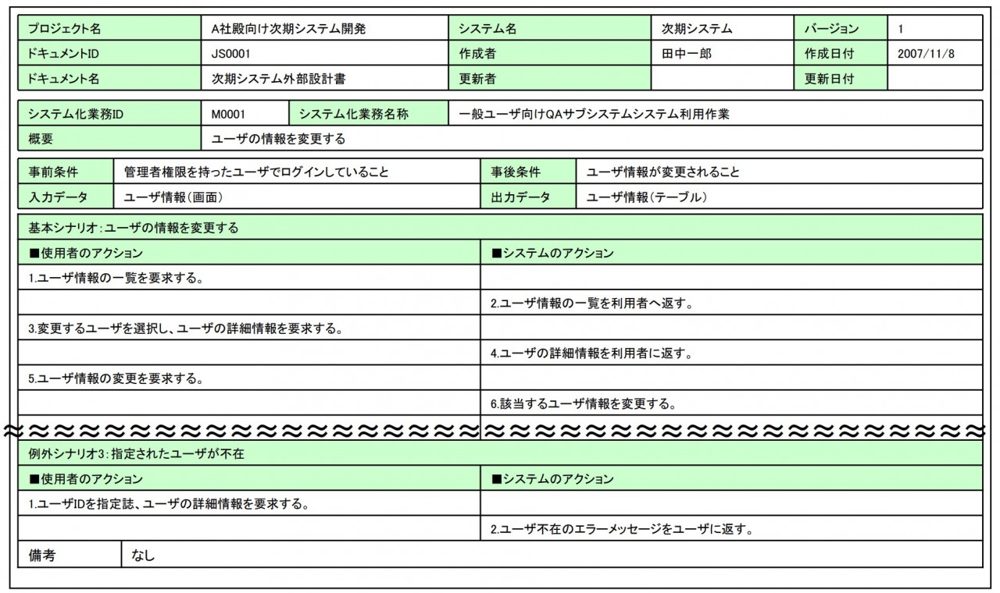
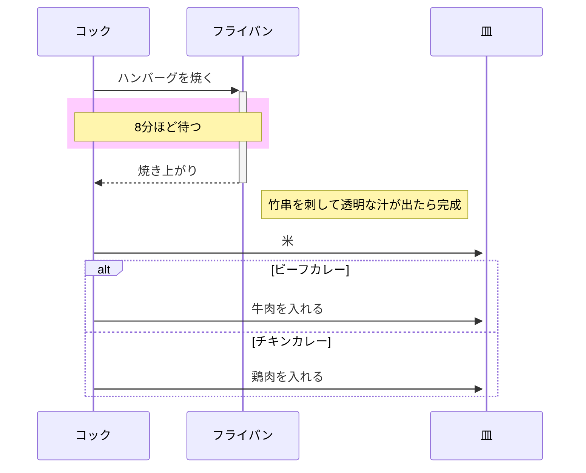
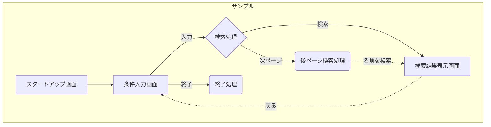
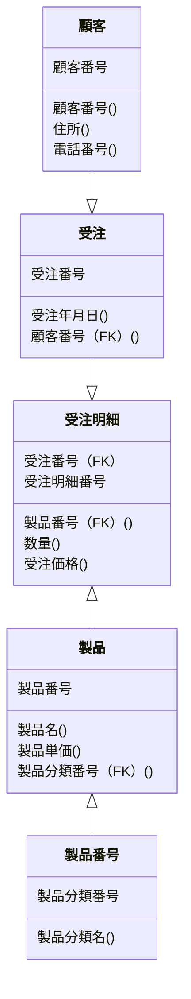

#``はじめに``

基本設計のことを「外部設計」と呼ぶ場合もあるが、当サイトでは「基本設計」に統一して記載している。

基本設計は、要件定義の結果を受けて、具体的なシステム構成や機能を設計する工程だ。

基本設計書には、下記の４つを検討のうえ成果物としてまとめる。
　・業務設計
　・システム方式設計
　・アプリケーション機能設計
　・非機能要件設計

要件定義書と同じく、企業によっては記載内容やテンプレートを整備している企業もあるので、まずは自社のルールを確認することをお勧めする。

※当サイトでは、情報処理推進機構（以下、IPA）や行政機関の資料を参考に記載している。
***
 

#`基本設計書のサンプル`

私が参考にした基本設計書のサンプルを紹介。

[IPA『機能要件の合意形成ガイド』](https://www.ipa.go.jp/sec/softwareengineering/reports/20100331.html)

[農林水産省『システム構成図』](https://www.maff.go.jp/j/kanbo/joho/densi_seihu/d_densan_system/pdf/genko6.pdf)

[国立研究開発法人『見守り情報管理システム 基本設計書』](https://warp.da.ndl.go.jp/info:ndljp/pid/9972728/ecom-plat.jp/fbox.php?eid=16496)

[国立研究開発法人『eコミマップ 基本設計書』](https://warp.da.ndl.go.jp/info:ndljp/pid/11275462/ecom-plat.jp/fbox.php?eid=16945&s=o)

上記の中でも、IPAの資料は、具体的な書き方や検討のコツも紹介されているので、特に参考になると思う。
***
 

#`基本設計書の目次（成果物一覧）`
それでは、ここからは基本設計書の書き方を説明していく。

プロジェクトの特性にもよるが、基本設計書には下記の内容を記載する。

<!-- @import "[TOC]" {cmd="toc" depthFrom=1 depthTo=6 orderedList=false} -->

<!-- code_chunk_output -->

####・基本設計書の目次
- [1.業務設計](#業務設計)
       - [1-1.システム化の背景・目的](#システム化の背景目的)
       - [1-2.システム化の対象範囲](#システム化の対象範囲)
       - [1-3.システム化業務一覧](#システム化業務一覧)
       - [1-4.新業務フロー](#新業務フロー)
       - [1-5.システム化業務説明](#システム化業務説明)
- [2.システム方式設計](#システム方針設計)
      - [2-1.ハードウェア構成図](#ハードウェア構成図)
      - [2-2.ソフトウェア構成図](#ソフトウェア構成図)
      - [2-3.ネットワーク構成図](#ネットワーク構成図)
      - [2-4.シーケンス図](#シーケンス図)
- [3.アプリケーション機能設計](#アプリケーション機能設計)
      - [3-1.画面遷移図](#画面遷移図)
      - [3-2.テーブル関連図(ER図)](#テーブル関連図er図)
- [4.非機能要件設計](#非機能要件設計)
      - [4-1.性能設計](#性能設計)
      - [4-2.信頼性設計](#信頼性設計)
      - [4-3.拡張性設計](#拡張性設計)
      - [4-4.セキュリティ設計](#セキュリティ設計)
      - [4-5.テスト方針](#テスト方針)
      - [4-6.移行方針](#移行方針)
      - [4-7.運用保守設計](#運用保守設計)
- [5.さいごに](#さいごに)

<!-- /code_chunk_output -->

***
 

#`業務設計`
業務設計は下記５つの成果物を整理する。

1-1.システム化の背景・目的
1-2.システム化の対象範囲
1-3.システム化業務一覧
1-4.新業務フロー
1-5.システム化業務説明
多くの資料は、要件定義でまとめているはずなので、基本設計で新たに作成する資料は少ない。

（要件定義での検討が不足していると、基本設計で苦労することになる）
 

####・システム化の背景・目的
システム化が必要な背景と目的を説明した資料。

要件定義書にもまとめられているはずなので、基本設計で新しく記載する必要はないだろう。

    背景：なぜシステム化が必要なのか？
    目的：システム化に何を期待するのか？
 

####・システム化の対象範囲
プロジェクトのシステム化の対象範囲を記載する。

後述の「業務機能構成表」や「アプリケーション機能構成図」に記載する場合もある。

こちらも要件定義書から転記すれば良い。
 

####・システム化業務一覧

| ＜管理者＞   |            | 機能 |      |      |     |     |      |          |
| :----------- | :--------- | :--- | :--- | :--- | :-- | :-- | :--- | :------- |
|              |            | 登録 | 検索 | 集計 | UL  | DL  | 削除 | 帳票印刷 |
| 設定         | 住居       | ○   | ○   | ×    | ○  | ○  | ○   | ×        |
|              | 部屋       | ○   | ○   | ×    | ○  | ○  | ×    | ×        |
| システム管理 | 項目設定   | ○   | ○   | ×    | ○  | ○  | ○   | ×        |
|              | 参照設定   | ○   | ○   | ×    | ○  | ○  | ○   | ×        |
|              | 画面管理   | ○   | ○   | ×    | ○  | ○  | ○   | ×        |
|              | マスタ     | ○   | ○   | ×    | ○  | ○  | ○   | ×        |
|              | ログ       | ×    | ○   | ×    | ×   | ×   | ×    | ×        |
|              | エリア     | ○   | ○   | ×    | ○  | ○  | ○   | ×        |
|              | マップ連携 | ○   | ○   | ×    | ○  | ○  | ○   | ×        |

業務機能構成表に対して、システム化対象業務を選定した資料。

要件定義書から転記する。

上記のサンプルのように、業務機能構成表に「システム化対象」という区分を設ける場合が多い。
 

####・新業務フロー

開発するシステムを適用し、新しい業務の流れを図解した資料。

要件定義書から転記することになるが、アプリケーション機能を具体化していく中で修正が必要になる場合もある。
 

####・システム化業務説明

システム化の業務について、詳細な内容を記載した資料。（”ユースケースシナリオ“という呼び方をした方がいいかもしれない）

利用者のアクションに対して、システムがどうアクションをするのかを記載する。

基本的な流れ「基本シナリオ」、基本外の流れ「代替シナリオ」に分けて整理していくと良い。

 

代替はシステム異常とは違うので注意。

下記のように、基本的な流れでは無いものの、一般的に起こる可能性のあるシナリオのことだ。

    基本シナリオ：晴れのときシナリオ
    代替シナリオ：雨のときのシナリオ
***
 

#`システム方針設計`

システム方式設計では、下記の成果物を整理する。

    　2-1.ハードウェア構成図
    　2-2.ソフトウェア構成図
    　2-3.ネットワーク構成図
    　2-4.アプリケーション機能構成図
性能や信頼性などの非機能要件をもとに，システム全体の構成を検討する作業だ。

システム構成は、要件定義段階でほぼ決定しているはずなので、設計の結果を反映させることが主な作業となる。
 

####・ハードウェア構成図

今回のシステムを実現するうえでのハードウェア構成を明確にする資料。

要件定義のハードウェア要件をもとに、基本設計で検討した内容を反映させる。

    ・ネットワーク
    　回線、ルータ、スイッチ、負荷分散装置、ファイアウォール等
    ・ストレージ
    　ディスク装置、テープ装置等

    ・サーバー
    　CPU、メモリ、入出力機構等
 

####・ソフトウェア構成図
今回のシステムを実現するうえでのソフトウェア構成を明確にする資料。

要件定義のソフトウェア要件をもとに、基本設計で検討した内容を反映させる。

    OS
    Windows、Mac-OS、Unix、Linux、iOS、Android等
 

    ミドルウェア
        ・データベース
        　Oracle、DB2、SQL Server、MySQL、PostgreSQL等

        ・Webサーバ
        　Apache、nginx、IIS等

        ・アプリケーションサーバ
        　WAS、Tomcat、WebLogic、JBoss、Interstage等

        ・データ連携
        　WebSphere MQ、HULFT

        ・統合運用管理
        　JP1、Systemwalker、Tivoli、A-AUTO等

 

####・ネットワーク構成図
今回のシステムを実現するうえでのネットワーク構成を明確にする資料。

要件定義のネットワーク要件をもとに、基本設計で検討した内容を反映させる。
 

####・シーケンス図

 
シーケンス図とは、クラスやオブジェクト間のやりとりを時間軸に沿って表現する図です。機能ごとに相互作用（Interaction）と呼ばれる下記のようなフレーム内に処理内容を記述します。

メッセージと呼ばれる矢印で各オブジェクト間の応答を表し、縦軸（上から下）を時系列として応答の順序を表現しています。

これにより、ある機能（例では在庫一覧）を実現する各オブジェクトが時間に沿ってどのように相互作用しているかがわかります。

***
 

#`アプリケーション機能設計`
基本設計のメインとなる作業だ。

要件定義のざっくりとした内容を元に、システムを実装できるレベルまで具体的に記載しよう。

####・画面遷移図

画面の流れが分かる資料。

要件定義書から転記しつつ、基本設計の検討結果を反映させよう。
 

####・テーブル関連図(ER図)

今回開発するシステムで用いるテーブルの関係性が分かる資料。

要件定義では業務上の主要なテーブルのER図を作成するが、基本設計では、システムを実現する上で必要なテーブルを全て書き出す。

    ・新しく作成するテーブル
    ・改廃する既存のテーブル
    ・参照する既存のテーブル
要件定義書に記載したテーブルはもちろんのこと、バッチ処理内で一時的に利用するテーブル（ワークテーブル）等の記載も書き出そう。
***
 

#`非機能要件設計`
非機能要件設計では下記の成果物を整理する。

    4-1.性能設計
    4-2.信頼性設計
    4-3.拡張性設計
    4-4.情報セキュリティ設計
    4-5.テスト方針
    4-6.移行方針
    4-7.運用保守設計
非機能要件設計の各資料には方針や考え方を記載し、具体的な設計内容は、アプリケーション機能や基盤設計の各資料に反映することとなる。
 

####・性能設計
要件定義の性能要件に対して、対応方針や評価方法を記載する。

    ・基準値
    　画面応答性、バッチ実行時間等
    ・対策
    　アプリケーション機能や基盤設計等の資料へ反映

    ・評価方法
    　テスト段階で、性能を評価する方法を記載
 

####・信頼性設計
要件定義の可用性と完全性の要件に対して、対応方針を記載する。

    ・可用性
    　「使いたいときに使えるか」の指標。一般的には稼働率を記載する。
    ・完全性
    　「データの欠損や不整合がないこと」の指標。
    　機器の破損への対策、ログの取得など、定性的な書き方となることが多い。
 

    設計の観点
    ・可用性
    　アプリ面：障害発生時の復旧方法等
    　基盤面　：システム多重化、縮退運用等
    ・完全性
    　アプリ面：データバックアップや更新ログの取得等
    　基盤面　：ディスクバックアップ、アクセスログ取得等
 

####・拡張性設計
要件定義の拡張性要件に対して、対応方針を記載する。
    ・規模の拡張性
    　利用者やデータの増加に伴うシステム拡張の対応策
    ・機能の拡張
    　機能追加の対応策
 

####・セキュリティ設計
要件定義のセキュリティ要件に対して、対応方針を記載する。

    ・情報（データ）や情報システムへのアクセスを制限するために、利用者IDの管理（パスワードの管理など）を行う。

    ・重要な情報に対するアクセス権限の設定を行う。

    ・インターネット接続に関わる不正アクセス対策（ファイアウォール機能、パケットフィルタリング、ISP サービス 等）を行う。

    ・無線LANのセキュリティ対策（WPA2 の導入等）を行う

    ・ソフトウェアの選定や購入、情報システムの開発や保守に際して、情報セキュリティを前提とした管理を行う。
 

####・テスト方針
要件定義のテスト要件に対して、テスト方針を記載する。

単体テスト・結合テスト・総合テスト・運用テストといった各テスト工程について、プロジェクトの特性に応じて、下記のような観点を記載する。

    テストの目的
    テストの概要
    テストの開始条件
    テストの環境
    テストデータの準備方針
    テストの実施タイミング
    役割分担
 

####・移行方針
要件定義の移行要件に対して、移行方針を記載する。

システム機能だけでなく、データ移行や新業務への移行等、プロジェクトの特性に応じて移行方法を記載する。
 

####・運用保守設計
要件定義では、定常運用・臨時運用・障害時運用における要件を記載したが、基本設計段階では、各要件を実現するに当たっての運用保守業務設計、および必要な環境や機能の設計を行う。

下記に具体的な検討内容例を紹介する。

    ・運用保守業務内容
    ・役割分担と対象範囲
    ・管理項目
    ・必要なシステムやドキュメント
    ・システム監視方法
    ・データ管理方法（ログなど）
    ・バックアップ方法
    ・障害対応方法
    など

運用保守業務に入る本番移行前〜フォロー期間にて詳細な内容を検討し、運用保守契約を締結することとなる。
 

####・さいごに
基本設計工程の成果物を紹介してきた。

最初に述べたように、作成する成果物やテンプレートや書き方は、企業の標準としてまとめられている場合もあるので確認してほしい。

また、過去案件の成果物を流用するのも良いだろう。

以上、参考になれば幸いだ。
<!-- @import "[TOC]" {cmd="toc" depthFrom=1 depthTo=6 orderedList=false} -->
